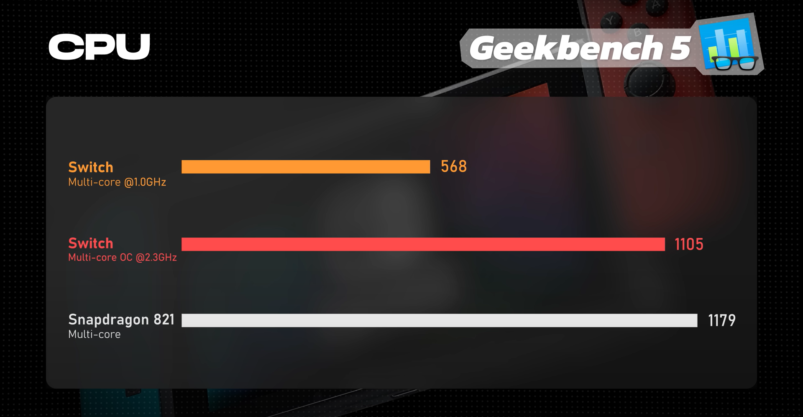

:::warning
This is not a comprehensive guide. Just a blog post about how I did it myself. If you want to "mod/hack" your Switch, I recommend following thourough guides on [switch.hacks.guide](https://Switch.hacks.guide) and following the dissassembly guides on [ifixit](https://www.ifixit.com/Teardown/Nintendo+Switch+Teardown/78263?srsltid=AfmBOopafqIlha4w_7wViLBNHRTsR9xevz8mXbvGGDWJCnt6BXANPRET). As always, you, and only you, are responsible for what happens to your console.
:::

# Background

I’ve had my Nintendo Switch sitting around and collecting dust for a while now. My interest was piqued when I learned about the combination of [box64](https://github.com/ptitSeb/box64) and [wine64](https://winehq.org), two programs that emulate x86 architectures and windows applications efficiently. I was even more excited when I learned about the [switchroot](https://switchroot.org/) project, a project that allows people to run Ubuntu 24.04, Fedora 39, and Android 14 on the Switch natively!

# How powerful is the Switch?

After doing a bit of research, the Switch runs on the Nvidia Tegra X1, an 8-year-old veteran ARM processor that still packs a bit of a punch!

Normally, the Switch’s CPU is underclocked and undervolted to a meager 1 GHz (for thermals and battery life). On the other hand, the X1 is rated to go as fast as 2 ghz, and with the correct overclocking, we can achieve 2.3 GHz on the CPU, 1267 MHz on the GPU, and 2311 MHz on the RAM. This is more on par with the Snapdragon 821, very impressive for a processor of this age.

# How can I jailbreak my Switch?

The main factor in the method of jailbreaking your Switch depends on your model. There are 2 main “models” for the original Switch Erista 2017 - early 2018 models (also referred to as unpatched or V1) and Mariko (patched, V2). You can find out which one you have at [Is My Switch Patched?](https://ismyswitchpatched.com/) and putting in your serial number.

For Erista consoles, there is a bug that exists, allowing you to short 2 pins on the right JoyCon rail to bypass BOOT0 and inject a payload for your Switch to boot instead of HorizonOS (normal Switch OS). This can be achieved by soldering a joy-con, or using a paperclip or rcm jig.

For Mariko (V2) consoles, they are only able to be jailbroken by using a modchip, which requires soldering 4 tiny contacts to 2 capacitors on the CPU to “voltage glitch” the CPU into booting payload.bin on the microsd card instead of BOOT0. The modchip works by infiltrating the communication between the main board and the sysnand. This is an extremely condensed explanation, and if you want to a full one, you can visit this website.

For Nintendo Switch oled models, you also need a modchip, but the process is much more lengthy and requires a microscope.
I, personally own a Switch V2, so I will go down the modchip route.

# Modchipping

For modchipping my Switch, I will be using the Picofly Core, based on the fully open source RP2040 microcontroller and it's firmware.

You can find this modchip on AliExpress by searching Picofly Core, for about $11-$12. I personally got the modchip in a flash sale, only costing me $1, making it $2.12 after taxes and shipping! Flash sales are pretty common, so I reccomend trying to find the modchip on multiple devices before buying. 

After waiting for around 2 weeks, the modchip is finally here!

The USB-C port on the modchip pugs into the computer, and by holding the BOOT button, we are able to flash the modchip with the [latest firmware](https://guide.nx-modchip.info/modchip/firmware/firmware.uf2).

You may have noticed by now that there are 2 SoC ribbon cables with version numbers labeled on them. This is because the modchip is compatible with both V1 and V2 Switches. (The only reason you would install a modchip on a V1 Switch is if you don't want to enter RCM every time you turn off and on the switch). For my purposes, I am using the V2 modchip SoC ribbon cable.

# 6-year-old flux and 215C Sticks

These are my recommendation for tools to install the modchip.

- A soldering iron with a small(er) tip (preferably temperature controlled that can reach 350C consistently)
- Good quality flux
- The right screwdriver bits (+00 and Y1.5 bits)
- Thermal paste (preferably non-conductive)
- Isopropyl Alcohol (preferably 95-99% IPA)
- Modchip (including the SoC ribbon cable)
- Toothpicks/Q-tips (to remove the thermal paste between the capacitors on the SoC die)
- Solder (leaded is recommended, unleaded will work depending on your skill level)
- Magnifying goggles/microscope (microscope is optional but recommended)

Time to open the Switch up!

 

The four tri-point Y1.5 bits are Nintendo's way of saying "keep out!", but the back cover comes off easily after removing the 7+00 bits, 2 on top, 2 on bottom, one hidden under the micro-sd card, and both of the the third screws down from the top on each Joy-Con rail.

If you think about it, the Switch is really impressive for its form factor, having an ingenious active cooling system.

Next step is to pick at and remove the micro-sd card reader.

 

Let's remove the 6 +00 screws to reveal the mainboard!

Removing the 3 screws on the heatsink reveals the IHS (Internal Heat Spreader), responsible for removing heat from the SoC die and the RAM. This is where the SoC ribbon cable will sit.

 

Time to pry open the IHS to expose the bare SoC die and RAM chips.

We can now clean up the thermal paste on the SoC die and around/in-between the capacitors on the SoC using IPA and q-tips.

Before we can install the modchip, we have to pre-tin the ribbon cable. This works by putting on solder onto the contacts before we install it. This is much easier than melting the solder when it is on the capacitor because it could cause overbridging.

After pre-tinning, we can melt the solder to bridge the capactor contacts.

Now, all that is left to do is to unplug the eMMc module and insert the modchip itself!

Turning the Switch on, we are greeted by the picofly menu!

We have installed the modchip successfully! This post is already getting long, so I will show what I will do with my jaibroken Switch in a later post. Stay tuned!
