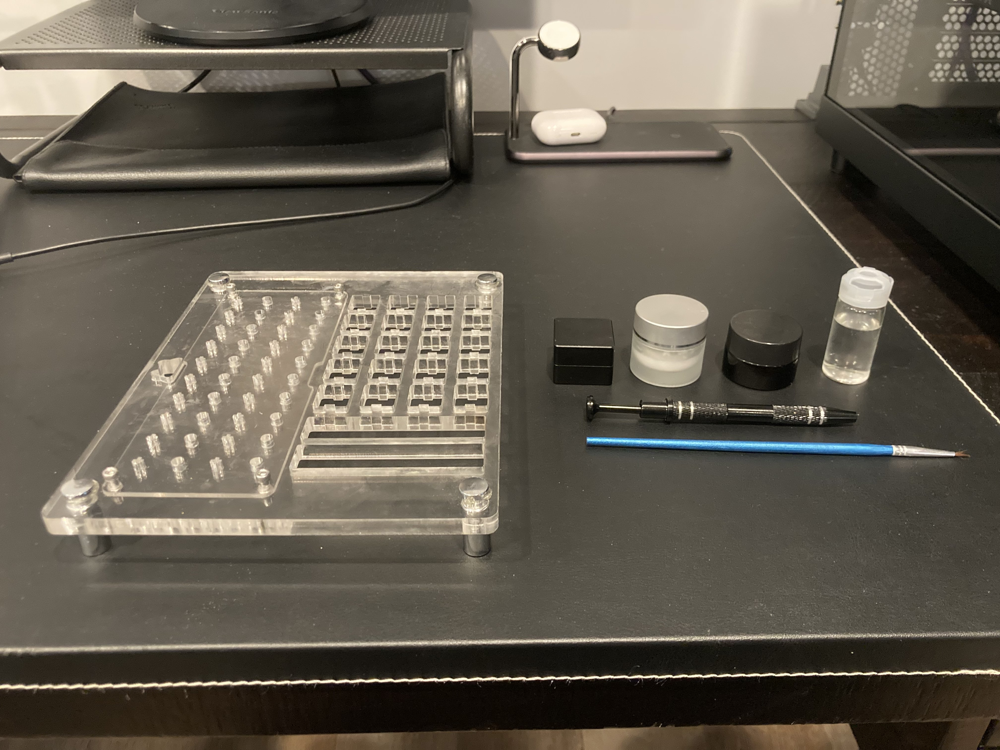
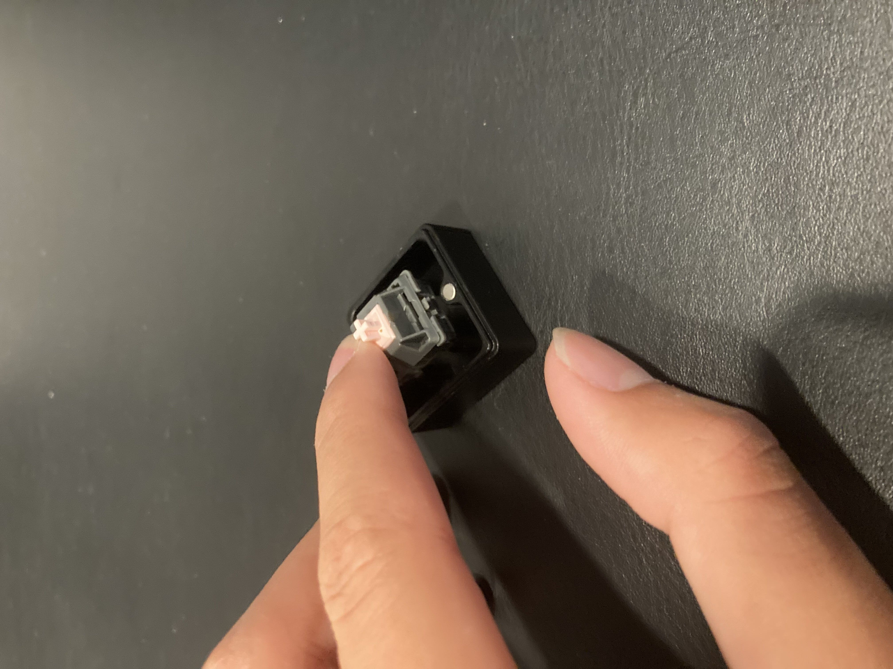
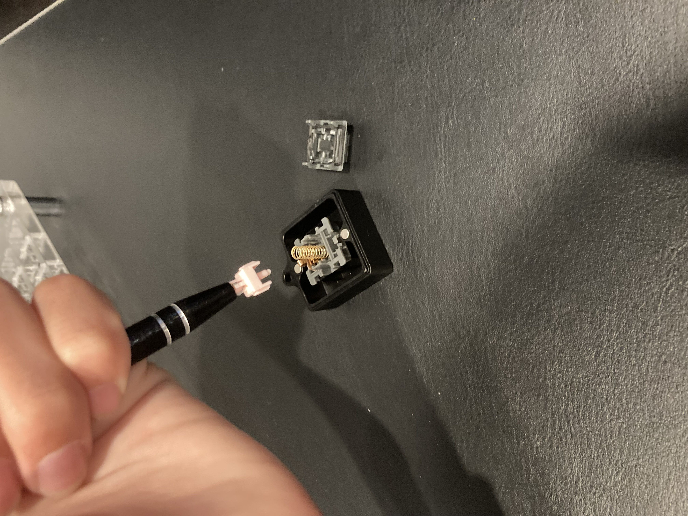
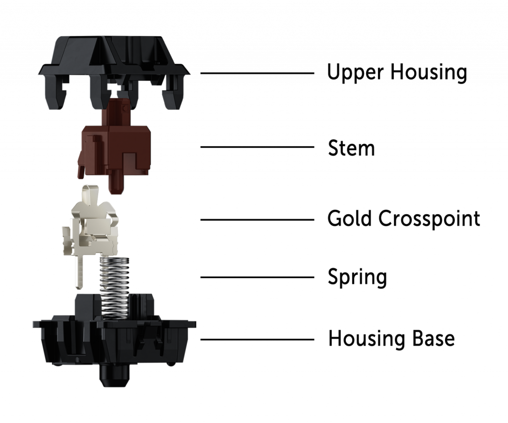
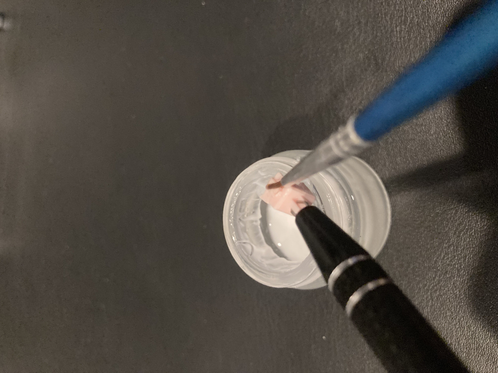
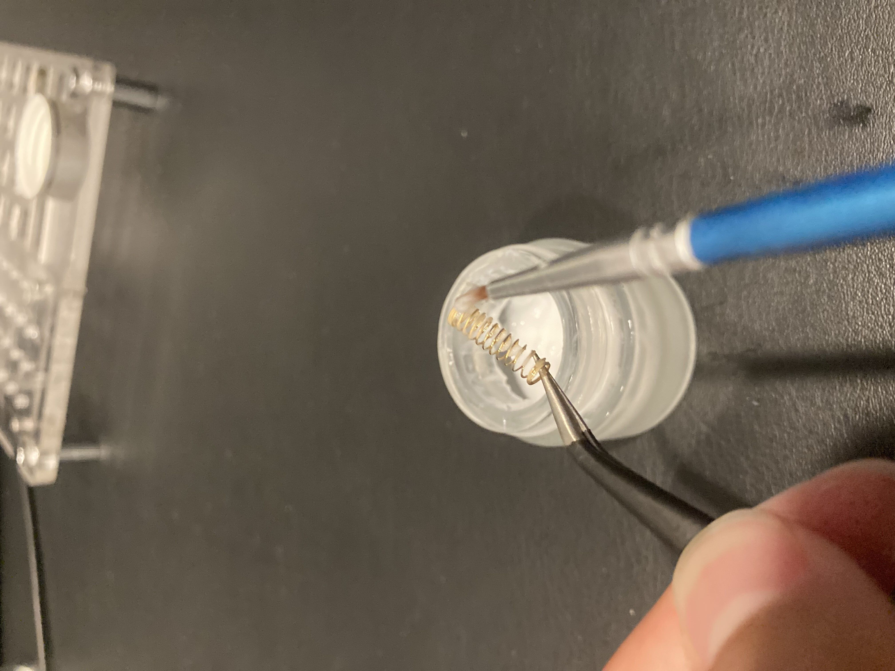
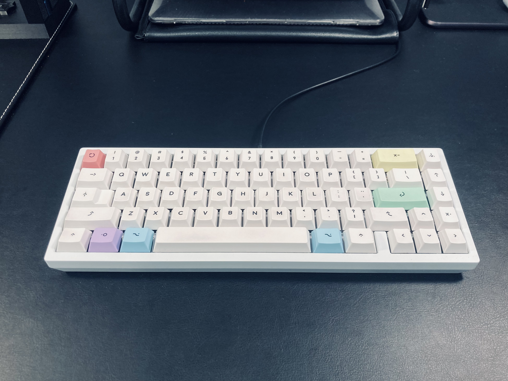
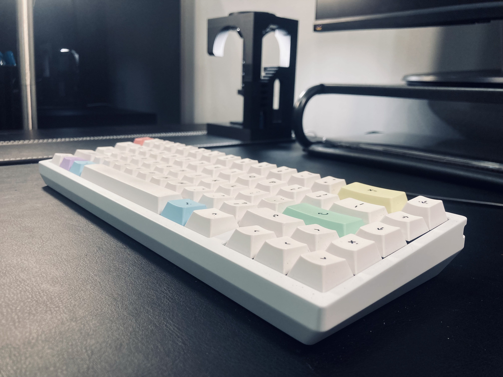

# Backstory

I built this specific keyboard a month ago, (before this blog existed) and never thought about posting it until now.
I was looking for something other than my modded Rainy75 Pro. After hours of researching, I decided on a creamy sound profile with linear switches, specifically Alpaca v2s. For the creamy sound profile, I decided on the Mode Envoy from mode designs with an FR4 plate, white coating, and gold accents and weights.

After ordering all the parts, it was time to assemble them.

## My personal lubing process

Lubing is essential to getting a smoother glide on any switch. But even with today’s much better factory lubing, I prefer to lube my switches myself.

From left to right: switch lubing station switch opener, Krytox 205g0, Krytox xht-bdz, Krytox 105g0, stem holder, brush.
While not essential, the switch lubing station helps a lot when having to mass-lube. It contains slots for springs, stems, and both the bottom and the top housings.

The switch opener, in my opinion, is absolutely essential for lubing. You could, try to pry open each of your switches with a screwdriver, but that comes with a risk of hurting yourself.

Each different type of lube has its own viscosity and use case. Krytox is a very popular brand in the hobbyist keyboard market, known for their industrial grade lubricants.

- 205g0: Stems, housings, and springs of switches
- xht-bdz: Stabilizer wires (Ill get to this later)
- 105g0: Oil based lube for springs
- Stem holder: Pretty self explanatory. Holds stems for easy lubing. Not essential, but it makes things 100x easier.
- Brush: A brush.

How a switch opener works

A switch after being opened.

The switch opener makes things way easier. All you have to do is press down on the switch to open it.

Once the switch is opened, the switch has 4 main parts. The top and bottom housings, the stem, and the spring. Personally, I prefer to only lube the stem and the spring, as the spring, which contats the bottom housing, will lube the bottom housing automatically. The stem, which contacts the top housing and slides against it, will also lube the top housing.

Lubing the stem of the switch with 205g0

Lubing the ends of the spring with 205g0

After inserting the switches, assembling the board with all the foams, and putting on the keycaps, we are done!

## Results

The keyboard turned out great, and I think it provides a much needed contrast to my all black setup.

Now, for the most important part, the sound!

<iframe width="100%" height="468" src="https://www.youtube.com/embed/8ZhRrg-9bFA?si=EAIgTtWXwXWJOf6M" title="YouTube video player" frameborder="0" allowfullscreen></iframe>

An interesting sound profile, it has some cremy-ness to it, but it also has something else I can't put my finger on. I personally like it!